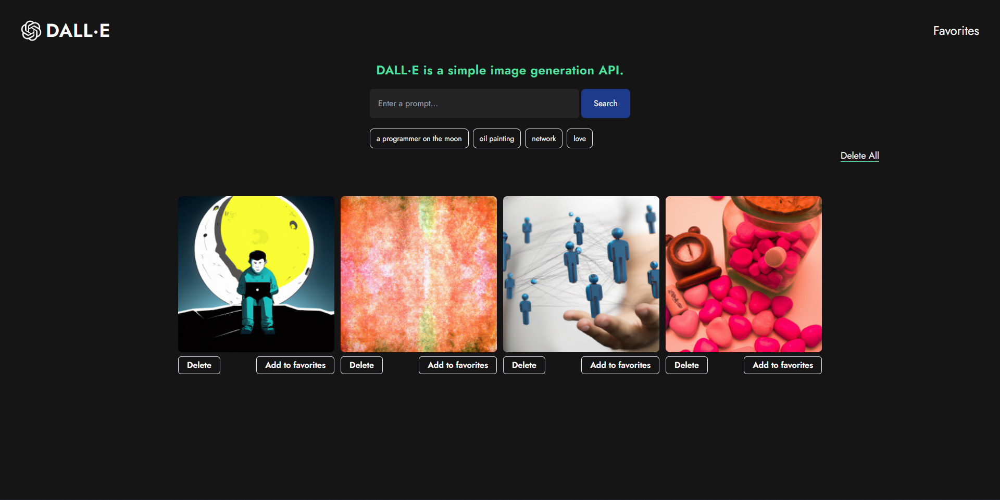

# Welcome to DALL·E clone 👋



## Inspiration

This project is inspired by [DALL·E](https://openai.com/blog/dall-e/), a neural network that generates images from text descriptions, using a dataset of text–image pairs.


## Usage

1. Clone the repo
   ```sh
   git clone
    ```


2. Install packages
    ```sh
    yarn install
    #or 
    npm install
    ```
3. Change the .env.template file to .env and add your OpenAI API

4. Run the project
    ```sh
    yarn dev
    #or 
    npm run dev
    ```

## Author

👤 **Guido Olguin**

## Contributing

Contributions, issues and feature requests are welcome!

## License

This project is [MIT](https://choosealicense.com/licenses/mit/) licensed.

***


## References

- [DALL·E](https://openai.com/blog/dall-e/)
- [OpenAI API](https://beta.openai.com/)
- [Next.js](https://nextjs.org/)
- [Tailwind CSS](https://tailwindcss.com/)
- [React-hot-toast](https://react-hot-toast.com/)